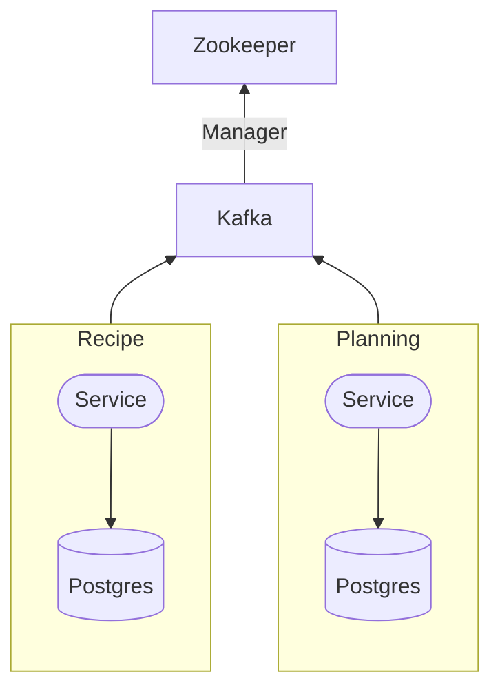

# Sina project

## Charts

Currently, the project supports following charts.

[//]: # (TODO: add description to chart and colors to specify local and k8s nodes)

```mermaid
flowchart BT
    A[Kafka] --> |Manager| B[Zookeeper]
    
    subgraph "Recipe"
        C([Service]) --> E[(Postgres)]
    end
    
    subgraph "Planning"
        D([Service]) --> F[(Postgres)]
    end
    
    Recipe --> A
    Planning --> A
```